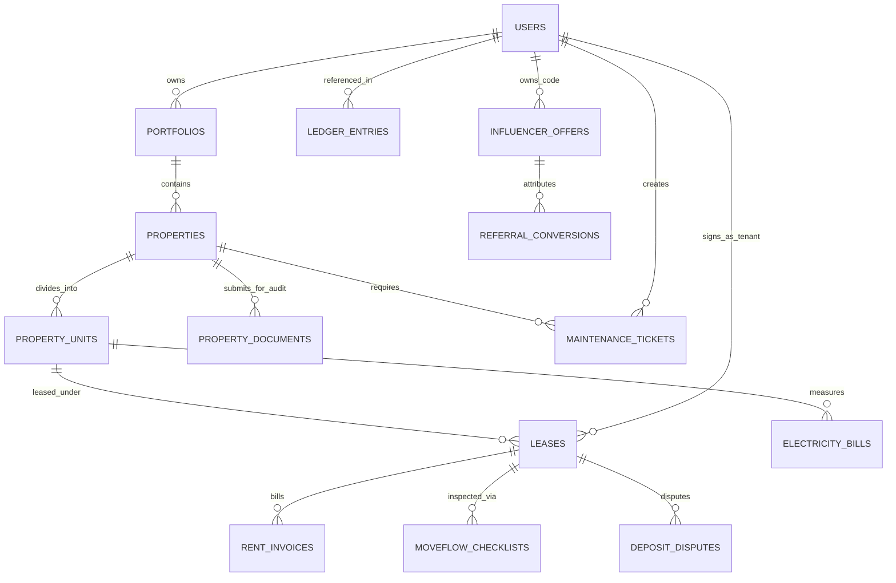

# Staywise — Production Database Architecture & Schema Specification

This document provides the complete, production-grade relational database architecture for the **Staywise** asset operating system. It is designed for **PostgreSQL 15+** with **Prisma ORM**, **Supabase**, or direct SQL migrations.

---

## 1. High-Level Entity-Relationship (ER) Overview



---

## 2. PostgreSQL DDL Schema Specification

```sql
-- ============================================================================
-- 1. ENUMS & CORE EXTENSIONS
-- ============================================================================
CREATE EXTENSION IF NOT EXISTS "uuid-ossp";
CREATE EXTENSION IF NOT EXISTS "pgcrypto";

CREATE TYPE user_role AS ENUM (
    'owner', 
    'tenant', 
    'manager', 
    'vendor', 
    'admin', 
    'estate_manager'
);

CREATE TYPE property_type AS ENUM (
    'Apartment', 'Flat', 'Independent House', 'Villa', 'Duplex', 'Studio',
    'PG', 'Hostel', 'Co-living', 'Dormitory',
    'Commercial Office', 'Retail Shop', 'Warehouse', 'Tech Park',
    'Boutique Hotel', 'Holiday Villa', 'Serviced Apartment'
);

CREATE TYPE property_status AS ENUM (
    'ACTIVE', 'VACANT', 'LISTED', 'UNDER_MAINTENANCE', 
    'OCCUPIED', 'PARTIALLY_OCCUPIED', 'RESERVED', 'ARCHIVED'
);

CREATE TYPE verification_status AS ENUM (
    'PENDING', 'APPROVED', 'REJECTED'
);

CREATE TYPE invoice_status AS ENUM (
    'Pending', 'Partially Paid', 'Paid', 'Overdue', 'Failed'
);

CREATE TYPE ledger_entry_type AS ENUM (
    'DEBIT', 'CREDIT'
);

CREATE TYPE ledger_entity_type AS ENUM (
    'RENT', 'MAINTENANCE', 'SECURITY_DEPOSIT', 'SETTLEMENT', 'COMMISSION', 'TAX'
);

-- ============================================================================
-- 2. USERS & PROFILES (Supports NextAuth / Supabase Auth)
-- ============================================================================
CREATE TABLE users (
    id UUID PRIMARY KEY DEFAULT gen_random_uuid(),
    email VARCHAR(255) UNIQUE NOT NULL,
    password_hash VARCHAR(255) NOT NULL,
    full_name VARCHAR(150) NOT NULL,
    phone VARCHAR(20),
    avatar_url TEXT,
    role user_role NOT NULL DEFAULT 'tenant',
    is_active BOOLEAN NOT NULL DEFAULT TRUE,
    two_factor_enabled BOOLEAN NOT NULL DEFAULT FALSE,
    created_at TIMESTAMPTZ NOT NULL DEFAULT NOW(),
    updated_at TIMESTAMPTZ NOT NULL DEFAULT NOW()
);

CREATE INDEX idx_users_email ON users(email);
CREATE INDEX idx_users_role ON users(role);

-- ============================================================================
-- 3. PORTFOLIOS (Grouping for Multi-Asset Landlords)
-- ============================================================================
CREATE TABLE portfolios (
    id UUID PRIMARY KEY DEFAULT gen_random_uuid(),
    owner_id UUID NOT NULL REFERENCES users(id) ON DELETE CASCADE,
    name VARCHAR(150) NOT NULL,
    description TEXT,
    created_at TIMESTAMPTZ NOT NULL DEFAULT NOW(),
    updated_at TIMESTAMPTZ NOT NULL DEFAULT NOW()
);

CREATE INDEX idx_portfolios_owner ON portfolios(owner_id);

-- ============================================================================
-- 4. PROPERTIES (Multi-Asset Core with Legal Verification Queue)
-- ============================================================================
CREATE TABLE properties (
    id UUID PRIMARY KEY DEFAULT gen_random_uuid(),
    portfolio_id UUID NOT NULL REFERENCES portfolios(id) ON DELETE CASCADE,
    name VARCHAR(200) NOT NULL,
    type property_type NOT NULL,
    address TEXT NOT NULL,
    city VARCHAR(100) NOT NULL,
    state VARCHAR(100) NOT NULL,
    pincode VARCHAR(20) NOT NULL,
    image_url TEXT,
    status property_status NOT NULL DEFAULT 'LISTED',
    verification_status verification_status NOT NULL DEFAULT 'PENDING',
    verified_by UUID REFERENCES users(id),
    verified_at TIMESTAMPTZ,
    rejection_reason TEXT,
    expected_monthly_rent NUMERIC(14, 2) NOT NULL DEFAULT 0.00,
    health_score INT NOT NULL DEFAULT 95,
    created_at TIMESTAMPTZ NOT NULL DEFAULT NOW(),
    updated_at TIMESTAMPTZ NOT NULL DEFAULT NOW()
);

CREATE INDEX idx_properties_portfolio ON properties(portfolio_id);
CREATE INDEX idx_properties_status ON properties(status);
CREATE INDEX idx_properties_verification ON properties(verification_status);

-- ============================================================================
-- 5. PROPERTY COMPLIANCE & LEGAL DOCUMENTS (Admin Audit Queue)
-- ============================================================================
CREATE TABLE property_documents (
    id UUID PRIMARY KEY DEFAULT gen_random_uuid(),
    property_id UUID NOT NULL REFERENCES properties(id) ON DELETE CASCADE,
    document_type VARCHAR(100) NOT NULL, -- 'Title Deed', 'Fire Safety NOC', 'Occupancy Certificate', 'Tax Receipt'
    document_url TEXT NOT NULL,
    verified BOOLEAN NOT NULL DEFAULT FALSE,
    uploaded_at TIMESTAMPTZ NOT NULL DEFAULT NOW()
);

CREATE INDEX idx_property_documents_property ON property_documents(property_id);

-- ============================================================================
-- 6. PROPERTY UNITS (Apartments, PG Rooms/Beds, Commercial Hubs)
-- ============================================================================
CREATE TABLE property_units (
    id UUID PRIMARY KEY DEFAULT gen_random_uuid(),
    property_id UUID NOT NULL REFERENCES properties(id) ON DELETE CASCADE,
    unit_number VARCHAR(50) NOT NULL,
    floor_number INT,
    carpet_area_sqft NUMERIC(10, 2),
    base_rent NUMERIC(12, 2) NOT NULL,
    security_deposit NUMERIC(12, 2) NOT NULL,
    bedrooms INT DEFAULT 1,
    bathrooms INT DEFAULT 1,
    is_occupied BOOLEAN NOT NULL DEFAULT FALSE,
    is_under_maintenance BOOLEAN NOT NULL DEFAULT FALSE,
    created_at TIMESTAMPTZ NOT NULL DEFAULT NOW()
);

CREATE INDEX idx_units_property ON property_units(property_id);
CREATE INDEX idx_units_occupancy ON property_units(is_occupied);

-- ============================================================================
-- 7. PG & CO-LIVING EXTENSIONS (Bed Grid & Meal Management)
-- ============================================================================
CREATE TABLE pg_beds (
    id UUID PRIMARY KEY DEFAULT gen_random_uuid(),
    unit_id UUID NOT NULL REFERENCES property_units(id) ON DELETE CASCADE,
    bed_identifier VARCHAR(20) NOT NULL, -- e.g. "Room 201 - Bed A"
    sharing_type VARCHAR(20) NOT NULL, -- 'Single', 'Double Sharing', 'Triple Sharing'
    status VARCHAR(20) NOT NULL DEFAULT 'AVAILABLE', -- 'AVAILABLE', 'OCCUPIED', 'RESERVED'
    monthly_rate NUMERIC(10, 2) NOT NULL,
    meal_plan_included BOOLEAN NOT NULL DEFAULT TRUE,
    created_at TIMESTAMPTZ NOT NULL DEFAULT NOW()
);

CREATE INDEX idx_pg_beds_unit ON pg_beds(unit_id);
CREATE INDEX idx_pg_beds_status ON pg_beds(status);

-- ============================================================================
-- 8. LEASES & TENANCY CONTRACTS
-- ============================================================================
CREATE TABLE leases (
    id UUID PRIMARY KEY DEFAULT gen_random_uuid(),
    unit_id UUID NOT NULL REFERENCES property_units(id),
    tenant_id UUID NOT NULL REFERENCES users(id),
    lease_start_date DATE NOT NULL,
    lease_end_date DATE NOT NULL,
    monthly_rent NUMERIC(12, 2) NOT NULL,
    deposit_amount NUMERIC(12, 2) NOT NULL,
    rent_due_day INT NOT NULL DEFAULT 5, -- 5th of every month
    salary_day INT DEFAULT 1,
    autopay_enabled BOOLEAN NOT NULL DEFAULT FALSE,
    agreement_document_url TEXT,
    is_active BOOLEAN NOT NULL DEFAULT TRUE,
    created_at TIMESTAMPTZ NOT NULL DEFAULT NOW(),
    updated_at TIMESTAMPTZ NOT NULL DEFAULT NOW()
);

CREATE INDEX idx_leases_unit ON leases(unit_id);
CREATE INDEX idx_leases_tenant ON leases(tenant_id);
CREATE INDEX idx_leases_active ON leases(is_active);

-- ============================================================================
-- 9. RENTFLOW INVOICES & PAYMENTS
-- ============================================================================
CREATE TABLE rent_invoices (
    id UUID PRIMARY KEY DEFAULT gen_random_uuid(),
    invoice_number VARCHAR(50) UNIQUE NOT NULL,
    lease_id UUID NOT NULL REFERENCES leases(id),
    billing_period VARCHAR(50) NOT NULL, -- 'October 2026'
    base_rent NUMERIC(12, 2) NOT NULL,
    cam_charges NUMERIC(12, 2) DEFAULT 0.00,
    utility_charges NUMERIC(12, 2) DEFAULT 0.00,
    late_fee NUMERIC(12, 2) DEFAULT 0.00,
    total_amount NUMERIC(12, 2) NOT NULL,
    paid_amount NUMERIC(12, 2) NOT NULL DEFAULT 0.00,
    due_date DATE NOT NULL,
    status invoice_status NOT NULL DEFAULT 'Pending',
    payment_method VARCHAR(50), -- 'UPI', 'Bank Transfer', 'Card', 'FlexPay'
    paid_at TIMESTAMPTZ,
    gateway_transaction_id VARCHAR(150),
    receipt_pdf_url TEXT,
    created_at TIMESTAMPTZ NOT NULL DEFAULT NOW()
);

CREATE INDEX idx_invoices_lease ON rent_invoices(lease_id);
CREATE INDEX idx_invoices_status ON rent_invoices(status);
CREATE INDEX idx_invoices_due_date ON rent_invoices(due_date);

-- ============================================================================
-- 10. SUB-METER ELECTRICITY BILLS & SPLIT ENGINE
-- ============================================================================
CREATE TABLE electricity_bills (
    id UUID PRIMARY KEY DEFAULT gen_random_uuid(),
    property_id UUID NOT NULL REFERENCES properties(id),
    billing_month VARCHAR(50) NOT NULL,
    master_meter_units NUMERIC(10, 2) NOT NULL,
    rate_per_unit NUMERIC(8, 2) NOT NULL,
    fixed_surcharge NUMERIC(10, 2) DEFAULT 0.00,
    total_bill_amount NUMERIC(12, 2) NOT NULL,
    document_image_url TEXT NOT NULL,
    uploaded_by UUID NOT NULL REFERENCES users(id),
    is_split_processed BOOLEAN NOT NULL DEFAULT FALSE,
    created_at TIMESTAMPTZ NOT NULL DEFAULT NOW()
);

-- ============================================================================
-- 11. STATUTORY DOUBLE-ENTRY ACCOUNTING LEDGER
-- ============================================================================
CREATE TABLE ledger_entries (
    id UUID PRIMARY KEY DEFAULT gen_random_uuid(),
    timestamp TIMESTAMPTZ NOT NULL DEFAULT NOW(),
    description TEXT NOT NULL,
    type ledger_entry_type NOT NULL, -- DEBIT or CREDIT
    amount NUMERIC(14, 2) NOT NULL,
    account_code VARCHAR(50) NOT NULL, -- e.g. "1010-ESCROW", "4010-RENT-REVENUE", "2010-SECURITY-DEPOSIT"
    entity_type ledger_entity_type NOT NULL,
    reference_id VARCHAR(100) NOT NULL, -- e.g. "INV-2026-1001", "DISP-892"
    created_by UUID REFERENCES users(id)
);

CREATE INDEX idx_ledger_timestamp ON ledger_entries(timestamp);
CREATE INDEX idx_ledger_reference ON ledger_entries(reference_id);
CREATE INDEX idx_ledger_account ON ledger_entries(account_code);

-- ============================================================================
-- 12. MOVEFLOW INSPECTIONS & DEPOSIT DISPUTES
-- ============================================================================
CREATE TABLE moveflow_checklists (
    id UUID PRIMARY KEY DEFAULT gen_random_uuid(),
    lease_id UUID NOT NULL REFERENCES leases(id),
    type VARCHAR(20) NOT NULL, -- 'MOVE_IN' or 'MOVE_OUT'
    category VARCHAR(100) NOT NULL, -- 'Walls & Paint', 'Plumbing', 'Electrical Fixtures', 'Keys'
    item_name VARCHAR(150) NOT NULL,
    is_passed BOOLEAN NOT NULL,
    condition_notes TEXT,
    evidence_photo_url TEXT,
    inspected_at TIMESTAMPTZ NOT NULL DEFAULT NOW()
);

CREATE TABLE deposit_disputes (
    id UUID PRIMARY KEY DEFAULT gen_random_uuid(),
    lease_id UUID NOT NULL REFERENCES leases(id),
    total_deposit NUMERIC(12, 2) NOT NULL,
    owner_deduction_claim NUMERIC(12, 2) NOT NULL,
    tenant_disputed_amount NUMERIC(12, 2) NOT NULL,
    deduction_reason TEXT NOT NULL,
    status VARCHAR(50) NOT NULL DEFAULT 'ARBITRATION_PENDING', -- 'RESOLVED', 'ARBITRATION_PENDING', 'RELEASED'
    resolved_at TIMESTAMPTZ
);

-- ============================================================================
-- 13. INFLUENCER OFFERS & PROMO CAMPAIGN ENGINE
-- ============================================================================
CREATE TABLE influencer_offers (
    id UUID PRIMARY KEY DEFAULT gen_random_uuid(),
    code VARCHAR(50) UNIQUE NOT NULL, -- e.g. 'KERALALUXURY'
    influencer_name VARCHAR(150) NOT NULL,
    influencer_handle VARCHAR(100) NOT NULL,
    commission_type VARCHAR(20) NOT NULL, -- 'PERCENTAGE' or 'FLAT'
    commission_value NUMERIC(10, 2) NOT NULL,
    audience_offer VARCHAR(255) NOT NULL, -- '₹1,500 Off 1st Month Rent'
    is_active BOOLEAN NOT NULL DEFAULT TRUE,
    clicks_count INT NOT NULL DEFAULT 0,
    conversions_count INT NOT NULL DEFAULT 0,
    total_commission_paid NUMERIC(12, 2) NOT NULL DEFAULT 0.00,
    created_at TIMESTAMPTZ NOT NULL DEFAULT NOW()
);

CREATE INDEX idx_influencer_code ON influencer_offers(code);
```

---

## 3. Row Level Security (RLS) Policies

To protect customer data in multi-tenant environments, enable PostgreSQL RLS:

```sql
-- Enable RLS on core tables
ALTER TABLE properties ENABLE ROW LEVEL SECURITY;
ALTER TABLE leases ENABLE ROW LEVEL SECURITY;
ALTER TABLE rent_invoices ENABLE ROW LEVEL SECURITY;

-- 1. Tenants can ONLY see their own leases and invoices
CREATE POLICY tenant_isolation_leases ON leases
    FOR SELECT USING (auth.uid() = tenant_id);

CREATE POLICY tenant_isolation_invoices ON rent_invoices
    FOR SELECT USING (
        lease_id IN (SELECT id FROM leases WHERE tenant_id = auth.uid())
    );

-- 2. Property Owners can only see properties in their portfolio
CREATE POLICY owner_isolation_properties ON properties
    FOR ALL USING (
        portfolio_id IN (SELECT id FROM portfolios WHERE owner_id = auth.uid())
    );

-- 3. Super Admins bypass RLS for platform surveillance
CREATE POLICY admin_full_access ON properties
    FOR ALL USING (
        EXISTS (SELECT 1 FROM users WHERE id = auth.uid() AND role = 'admin')
    );
```

---

## 4. Prisma ORM Schema (`schema.prisma`) Reference

```prisma
datasource db {
  provider = "postgresql"
  url      = env("DATABASE_URL")
}

generator client {
  provider = "prisma-client-js"
}

enum UserRole {
  owner
  tenant
  manager
  vendor
  admin
  estate_manager
}

enum VerificationStatus {
  PENDING
  APPROVED
  REJECTED
}

model User {
  id                 String              @id @default(uuid())
  email              String              @unique
  fullName           String
  role               UserRole            @default(tenant)
  portfolios         Portfolio[]
  leases             Lease[]
  createdAt          DateTime            @default(now())
}

model Property {
  id                 String              @id @default(uuid())
  portfolioId        String
  portfolio          Portfolio           @relation(fields: [portfolioId], references: [id])
  name               String
  type               String
  address            String
  city               String
  status             String
  verificationStatus VerificationStatus  @default(PENDING)
  units              PropertyUnit[]
  documents          PropertyDocument[]
  createdAt          DateTime            @default(now())
}

model PropertyUnit {
  id                 String              @id @default(uuid())
  propertyId         String
  property           Property            @relation(fields: [propertyId], references: [id])
  unitNumber         String
  baseRent           Decimal             @db.Decimal(12, 2)
  securityDeposit    Decimal             @db.Decimal(12, 2)
  leases             Lease[]
}

model Lease {
  id                 String              @id @default(uuid())
  unitId             String
  unit               PropertyUnit        @relation(fields: [unitId], references: [id])
  tenantId           String
  tenant             User                @relation(fields: [tenantId], references: [id])
  startDate          DateTime
  endDate            DateTime
  monthlyRent        Decimal             @db.Decimal(12, 2)
  invoices           RentInvoice[]
}

model RentInvoice {
  id                 String              @id @default(uuid())
  invoiceNumber      String              @unique
  leaseId            String
  lease              Lease               @relation(fields: [leaseId], references: [id])
  totalAmount        Decimal             @db.Decimal(12, 2)
  paidAmount         Decimal             @db.Decimal(12, 2) @default(0)
  status             String              @default("Pending")
  dueDate            DateTime
}
```
